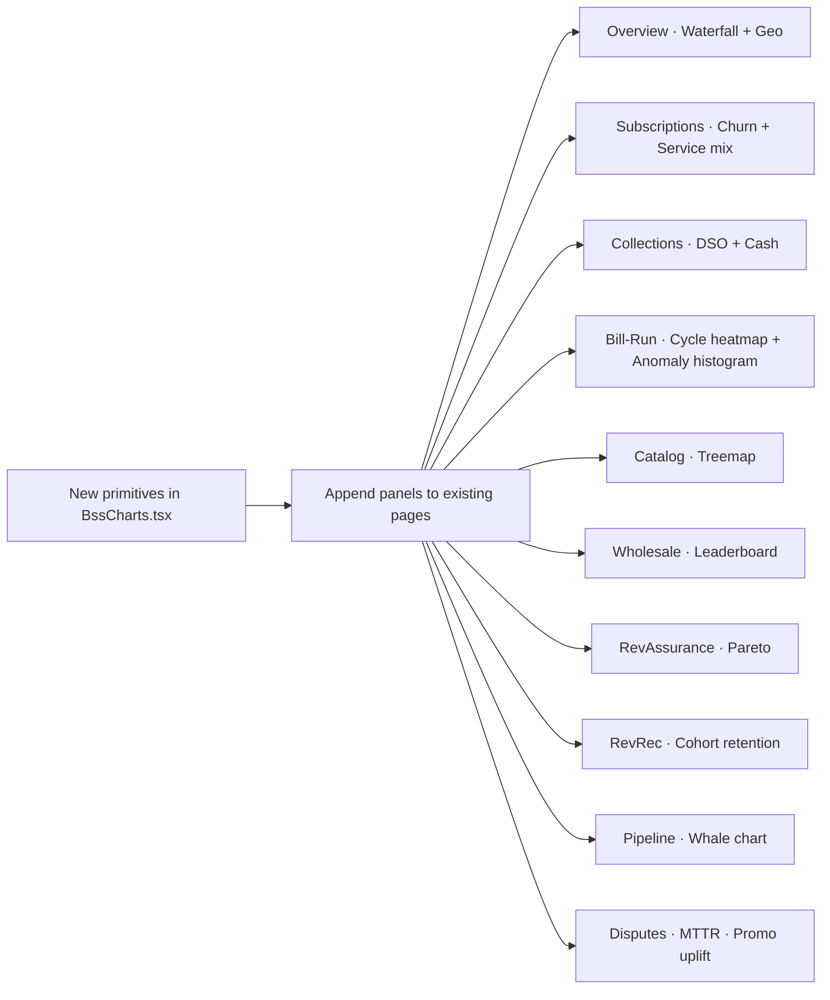

# BSS visuals — 15 new charts

## What lands where

| # | Chart | Page | New primitive |
|---|---|---|---|
| 1 | Revenue waterfall · QoQ | `/bss` Overview | reuse existing `Waterfall` |
| 2 | MRR/ARR cohort retention | `/bss/revrec` | new `CohortRetentionLayer` |
| 3 | Subscription churn waterfall | `/bss/subscriptions` | reuse `Waterfall` |
| 4 | DSO / DPD trend | `/bss/collections` | new `BandedLineChart` |
| 5 | Bill-cycle heatmap | `/bss/bill-run` | reuse existing `Heatmap` |
| 6 | Cash position trend (forward 12mo) | `/bss/collections` | new `AreaChart` |
| 7 | UK geo revenue heatmap | `/bss` Overview | new `UkRegionMap` (svg blocks per region) |
| 8 | Catalog product treemap | `/bss/catalog` | new `Treemap` |
| 9 | Wholesale partner leaderboard | `/bss/wholesale` | new `StackedDeltaBars` |
| 10 | RevAssurance Pareto | `/bss/revenue-assurance` | new `ParetoChart` |
| 11 | Service mix evolution | `/bss/subscriptions` | new `StackedAreaChart` |
| 12 | B2B whale chart (Pareto) | `/bss/pipeline` | reuse `ParetoChart` |
| 13 | Dispute MTTR histogram | `/bss/disputes` | new `Histogram` |
| 14 | Bill anomaly histogram | `/bss/bill-run` | reuse `Histogram` |
| 15 | Promo holdout-vs-treatment | `/bss/promotions` | reuse existing `HBar` |

8 new primitives total. The rest reuse what's already in `Charts.tsx` and `BssCharts.tsx`.

## Architecture

## Files touched

**Edited (5):**
- [src/pages/bss/BssExtended.tsx](src/pages/bss/BssExtended.tsx) — 8 new primitives + panel additions on Subscriptions, Bill-Run, Disputes, RevRec, Pipeline, Promotions, Wholesale.
- [src/pages/bss/BssOverview.tsx](src/pages/bss/BssOverview.tsx) — Revenue waterfall + UK geo heatmap on Overview; Catalog treemap on Catalog; Pareto on RevAssurance; DSO + Cash on Collections.
- [src/pages/bss/BssBilling.tsx](src/pages/bss/BssBilling.tsx) — no changes (bill-shock already added).
- [src/pages/bss/BssO2A.tsx](src/pages/bss/BssO2A.tsx) — no changes.
- [src/pages/Lineage.tsx](src/pages/Lineage.tsx) — 4 new gold tables (`gold.revenue_movements`, `gold.cash_position`, `gold.geo_revenue`, `gold.product_performance`).

## New primitives (in BssExtended.tsx)

- `Treemap` — recursive rectangle layout, animated mount.
- `ParetoChart` — bars + cumulative-% line.
- `BandedLineChart` — line with green/amber/red SLA bands.
- `AreaChart` — single-series area with optional confidence band.
- `StackedAreaChart` — multi-series stacked area.
- `StackedDeltaBars` — partner bars with QoQ delta colour chips.
- `Histogram` — bucketed bar histogram with mean/median markers.
- `UkRegionMap` — simplified UK regional grid (12 cells: London, SE, SW, Mid-East, Mid-West, NE, NW, Yorks, NW-Eng, Scot, Wales, NI), colour-mapped by revenue density.
- `CohortRetentionLayer` — stacked-area cohort survival.

All framer-motion + CSS/SVG, no external libs.

## Per-page panel spec (concise)

### `/bss` Overview
- **Revenue waterfall (QoQ)**: Q-open £142M · +adds £18M · +cross-sell £6M · −churn £8M · −price £2M · roaming/usage £4M · Q-close £160M.
- **UK geo revenue heatmap**: 12 regional tiles coloured by ARPU × density; hover shows region + £/mo.

### `/bss/subscriptions`
- **Churn waterfall**: monthly · Gross adds 184k · Win-back 24k · Voluntary loss −96k · Involuntary −18k · Net +94k.
- **Service mix evolution**: 12-month stacked area (Mobile / Bundle / Roaming / Add-ons / Watch / Broadband).

### `/bss/collections`
- **DSO trend (12wk)**: banded line (green ≤25d, amber 25-32, red >32). Current 24.8d.
- **Cash position (forward 12mo)**: area + p10/p50/p90 confidence band.

### `/bss/bill-run`
- **Cycle heatmap**: 10 cycle groups × 12 months · QA pass %.
- **Bill anomaly histogram**: distribution of bill ratios; mean line at 1.0x; outliers right-tail.

### `/bss/catalog`
- **Product performance treemap**: 18 SKUs sized by revenue, coloured by margin (red < 25% · amber 25-35% · green ≥ 35%).

### `/bss/wholesale`
- **Partner leaderboard**: stacked bar of revenue per partner with QoQ delta chips, top 14 MVNOs.

### `/bss/revenue-assurance`
- **Pareto chart**: top 8 leakage causes, cumulative-% reaches 80% by cause 3.

### `/bss/revrec`
- **Cohort retention layer**: 6 quarterly cohorts, stacked-area survival; bottom shows GRR/NRR.

### `/bss/pipeline`
- **B2B whale chart**: top 100 accounts as Pareto bars + cumulative-% line; concentration metric.

### `/bss/disputes`
- **MTTR histogram**: distribution of resolution times in hours, by dispute type.

### `/bss/promotions`
- **Holdout-vs-treatment leaderboard**: per-promo treatment-vs-control uplift bar chart with p-values (reuse the existing HBar pattern).

## Implementation steps

1. Build 8 new primitives in `BssExtended.tsx`.
2. Append 4 gold-table rows in `Lineage.tsx`.
3. Insert each panel into the correct page (10 page touches).
4. Typecheck + browser walk.

## Verification

- `node node_modules/typescript/lib/tsc.js --noEmit` clean.
- Hard-refresh each of the 10 pages, confirm new panels render with believable data, no oval-dot/stretched-text regressions, no overlap with the scenario transport (which already has `pb-28` global padding).
- Animations: each new primitive animates on mount with staggered framer-motion.

## Critical files

- [src/pages/bss/BssExtended.tsx](src/pages/bss/BssExtended.tsx) — 8 new primitives + panel injections
- [src/pages/bss/BssOverview.tsx](src/pages/bss/BssOverview.tsx) — Revenue waterfall, geo, catalog, RA, collections panels
- [src/pages/Lineage.tsx](src/pages/Lineage.tsx) — 4 new gold tables

## Phasing

A — primitives + gold tables. B — Overview + Catalog + Wholesale + RA panels. C — Subscriptions + Collections + Bill-Run + RevRec + Pipeline + Disputes + Promotions panels. Typecheck after each.

## Risk

Moderate. 8 new primitives is the biggest cognitive load; will keep them small (~30-50 lines each) and reuse the existing card pattern. No engine or schema changes.