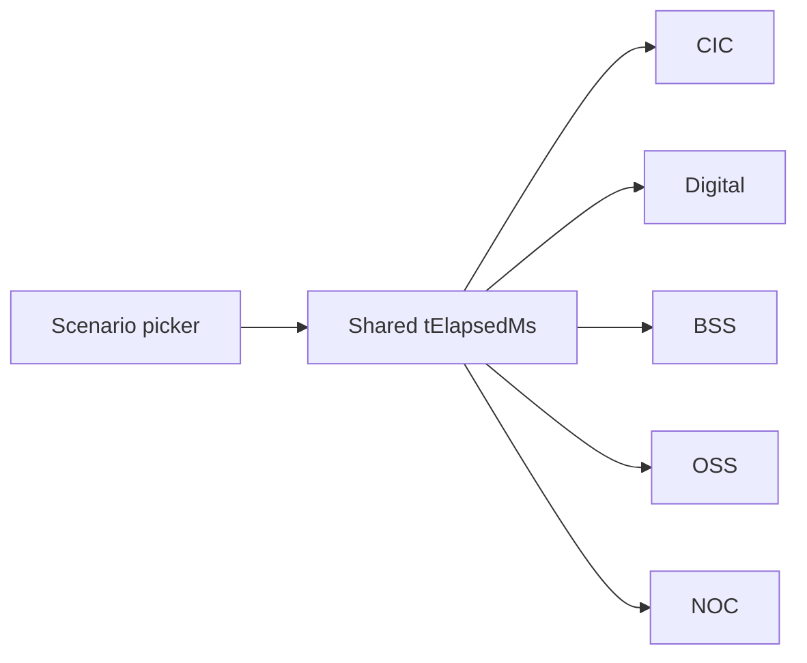

# Cross-domain scenarios

## Goal
A presenter picks a scenario once. Pressing **Auto-drive** in any of the five domains plays the same story, but each domain shows the slice that is meaningful for it.

Example with the existing **Manchester M14 RAN congestion** scenario:

| Domain | What you see during the same play |
|---|---|
| NOC | Detect → MLB + carrier-add → verify (the existing rich script) |
| OSS | Capacity-planner spike, ServiceNow CHG0012987, post-implementation review |
| BSS | 2,417 service credits queued, Ofcom auto-comp evaluated, dispute risk score |
| CIC | 89 P1 cohort scored, retention NBA, approval workflow, projected churn 79% → 47% |
| Digital | Channel orchestrator dispatches SMS/Push/Email, consent + cap checks |

Same `tElapsedMs`. Different lens.

## Design

### 1. Scenario as the unit
Replace the current "incident" picker with a `Scenario` that owns:
- `id`, `title`, `kicker`, `domains` (which domains have a script), `durationSec`.
- One **shared script** of timed events keyed by `domain`.
- Optional NOC-specific telemetry (cells, KPIs, action targets) for the existing NOC view.



### 2. Where the picker lives
Two-line header: row 1 keeps the 5-segment domain toggle; row 2 (small, optional) shows **Scenario · Auto-drive · Speed · Sound · Big-screen**. The picker is global; whichever domain you are looking at hears the same clock.

### 3. Script schema
```ts
// src/data/scenariosV2.ts
type DomainKind = 'cic' | 'digital' | 'bss' | 'oss' | 'noc';
interface CrossEvent {
  atSec: number;
  domain: DomainKind | 'all';
  kind: 'detect' | 'observe' | 'plan' | 'act' | 'verify' | 'log' | 'kpi';
  text: string;
  payload?: Record<string, unknown>; // e.g. { creditsQueued: 2417, mttr: 7.4 }
}
interface ScenarioV2 {
  id: string;
  title: string;
  kicker: string;
  durationSec: number;
  domains: DomainKind[];
  events: CrossEvent[];
  // domain-specific deep payloads (optional)
  noc?: { incidentId: string; kpiTargets: Record<string, number>; ... };
  bss?: { creditsQueued: number; serviceCreditPerCust: number; ... };
  cic?: { cohortIds: string[]; nbaPlaybook: string; ... };
  digital?: { channels: ChannelPlan[] };
  oss?: { changeId: string; pir: boolean };
}
```

The existing NOC scripts are migrated to fill the `noc` block + the `events[]` for `domain==='noc'`. Then we add events for the other domains.

### 4. State plumbing
Extend `DemoStateProvider`:
- `scenarioV2Id` (persisted), `setScenarioV2Id`.
- Shared `nocPlaying` becomes `playing` (alias both for back-compat).
- Same RAF tick — but `firedEvents` is now filtered by domain in each page.
- Each page reads `useScenarioPlayback(domain)` returning `{ events, kpis, progress }` for that lens.

### 5. Per-domain bindings
Each page already has its content; the playback simply reveals it progressively + animates the relevant numbers.
- **NOC** — unchanged behaviour (existing rich live view).
- **OSS** — new: a Service-Operations live view that shows ServiceNow CHG progress, capacity-trigger, PIR draft.
- **BSS** — new: live view that animates service credits, Ofcom auto-comp evaluation, dispute risk; Order-to-Activate + Billing pages stay self-contained.
- **CIC** — Command Center already has a CIC scenario engine; we map the cross-event clock onto it (advance stage when `domain==='cic' && kind==='act'` etc.).
- **Digital** — Channel Orchestrator + Conversational AI listen to events with `domain==='digital'`.

## Realistic scenario catalogue (proposal)

The current 5 (Manchester, Liverpool, Leeds, London HSS, SIM-swap) are good. Below are **6 candidates** that genuinely span multiple domains and are common in real MNOs.

### A. **Roaming partner outage** — `roaming-partner-outage`
*Domains*: NOC · BSS · Digital · CIC · OSS
*What happens*: GRX/IPX partner X drops; outbound roamers lose data in 14 countries; inbound roamers from partner X stop registering. NOC isolates; BSS pauses billing for affected sessions to avoid bill-shock; Digital pushes proactive comms to roamers via app push (with Ofcom-friendly wording); CIC scores the cohort for goodwill; OSS opens vendor escalation, posts to TMF 645 trouble-ticket.

### B. **Major credit-bureau outage during O2A** — `bureau-outage-o2a`
*Domains*: BSS · Digital · CIC · OSS
*What happens*: Experian API down for 38 minutes during Saturday peak. BSS detects via O2A failure rate; agent switches to fallback bureau (Equifax) with stricter risk model; Digital surfaces "We're checking — you'll hear back in a moment" to in-flight orders; CIC tags affected applicants for follow-up; OSS opens vendor incident; BSS post-mortem reconciles auto-approved orders.

### C. **STIR/SHAKEN robocall storm** — `robocall-storm`
*Domains*: NOC · CIC · Digital · BSS
*What happens*: ~1.2k inbound calls per second with spoofed numbers hit the SBC. NOC throttles; CIC identifies victim cohort (frequent callees); Digital pushes "Suspicious-call alert" notifications; BSS suspends billing on impacted Wangiri call-back fraud. References real Ofcom guidance on call-trace.

### D. **5G slice SLA breach for an enterprise tenant** — `enterprise-slice-sla`
*Domains*: OSS · NOC · BSS · CIC (B2B)
*What happens*: A B2B tenant's URLLC slice latency p99 breaches contractual 10ms. NOC isolates; OSS reroutes; BSS computes SLA credits per the MSA; CIC (B2B account team) gets a briefing-quality summary auto-drafted.

### E. **Mass SIM-swap fraud campaign** — `mass-simswap`
*Domains*: BSS · Digital · NOC · CIC · OSS
*What happens*: A coordinated wave of social-engineered SIM-swaps from a call-centre operator. Pattern recognised across 47 customers in 18 minutes. BSS freezes all suspect orders; Digital steps up MFA on the entire postcode; CIC orchestrates Care callbacks on registered MSISDNs; OSS opens a P1 fraud incident plus an HR investigation. Builds on existing single-customer SIM-swap.

### F. **Marketing campaign over-targeting → bill-shock cascade** — `bill-shock-campaign`
*Domains*: Digital · CIC · BSS · OSS
*What happens*: A new "use-it-or-lose-it" data-boost SMS campaign accidentally targeted 22k post-paid customers with high overage history; usage spikes; bill-shock complaints surge. Digital agent detects, halts campaign; BSS suspends auto-bill; CIC builds remediation cohort; OSS opens RA leakage ticket.

### G. **Tower mains-failure + battery exhaustion** — `tower-mains-failure`
*Domains*: NOC · OSS · CIC · Digital
*What happens*: Mains drop at a rural site (e.g. North Yorkshire); battery depletes after 3h; cells go dark. NOC detects; OSS dispatches generator/field-tech; CIC identifies high-CLV residents impacted; Digital notifies via app push (battery-aware comms strategy).

### H. **Ofcom auto-compensation eligibility wave** — `ofcom-autocomp`
*Domains*: BSS · CIC · OSS · NOC
*What happens*: A multi-cell outage exceeds the Ofcom 2-hour automatic-compensation threshold. BSS evaluates eligibility per Ofcom rules; CIC personalises the apology; OSS triggers PIR; NOC closes the technical loop. References Ofcom GC C7.

## Recommended scope
Build the **infrastructure once**, then ship **3 cross-domain scenarios** in this iteration to prove the model:
1. **Manchester M14** (existing) — extend events to fan out to CIC/BSS/Digital/OSS.
2. **Roaming partner outage** (A) — broadest fan-out, regulator-friendly.
3. **Mass SIM-swap fraud** (E) — security flavour, very current.

The remaining 6 (B, C, D, F, G, H) become a follow-on backlog.

## Files

### Modify
- `src/state/DemoStateProvider.tsx` — add `scenarioV2Id` + alias `playing`, fold `firedEvents` to be cross-domain.
- `src/components/app/AppHeader.tsx` — add a second small row with the global Scenario picker + Auto-drive + Speed.
- Each page that has Auto-drive — replace local `usePageAutoDrive` for the controls with global playback (keep local fallback for non-scenario pages).
- `src/pages/NocCommandCenter.tsx`, `EventStream.tsx`, `NocAgents.tsx` — read events filtered to `domain==='noc'` (no behavioural change).

### New
- `src/data/scenariosV2.ts` — 3 cross-domain scenarios.
- `src/state/useScenarioPlayback.ts` — hook returning `{ events, kpis, progress }` for a given domain.
- `src/pages/oss/OssLive.tsx` — Service-Ops live view that listens to OSS events.
- `src/pages/bss/BssLive.tsx` — BSS live view (credits, auto-comp, RA flags).
- `src/pages/digital/DigitalLive.tsx` — Digital live view (channels + conversations + voice all in one).

### Out of scope (this round)
- Scenarios B, C, D, F, G, H (proposal only).
- Persona / Compliance / FinOps lenses.
- Mobile layout.
- Real Snowflake calls.

## Open questions
- **Q1 — Picker location**: second header row (recommended), or a slide-down "scenario tray" triggered from the existing controls?
- **Q2 — Initial set**: ship 3 cross-domain scenarios this round (Manchester + Roaming + Mass SIM-swap) — agree, or pick a different 3 from the catalogue?
- **Q3 — Live views**: do we add net-new "Live" pages per domain (BSS/OSS/Digital), or fold the cross-domain reveal into the existing landing pages? Recommended: net-new `Live` pages so existing pages stay focused.
- **Q4 — Big-screen mode**: show a multi-domain mosaic (small CIC + Digital + BSS + OSS + NOC tiles) when in Big-screen?
- **Q5 — Scenario telemetry**: should each scenario report a single set of cross-domain KPIs (e.g. "MTTR · Customers protected · Revenue saved · SLA breaches") on top of the page? Recommended: yes — nine-box mini KPI strip.
