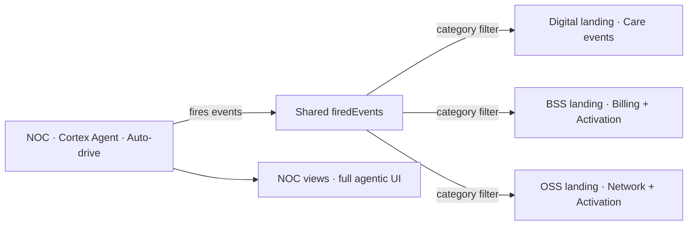

# Domains in sync — not all agentic

## Principle
**NOC is agentic. Digital, BSS, OSS are operational dashboards that respond to NOC's actions.**

Real telcos work this way:
- The agent in the NOC orchestrates the loop.
- Digital/BSS/OSS systems receive instructions (push playbook, pause billing, dispatch tech) and execute deterministically.
- Their dashboards reflect what the agent has done, not their own AI.

## What changes

### Auto-drive button — NOC only
Remove the standalone Auto-drive button from:
- `/bss/order-to-activate`
- `/bss/billing`
- `/digital/channels`

Keep the pages **interactive** (Run order / Build bill stays as a manual demo button), but they no longer compete with NOC for "auto-drive" airtime.

Auto-drive lives where it belongs: in **NOC Command Center**, **NOC Agents**, **Event Stream** (NOC mode).

### Landing pages = synchronized live views
When a NOC scenario is playing (`nocPlaying=true` or `tElapsedMs>0`), the **landing pages** of Digital/BSS/OSS show a "Live now" banner with the current scenario name, T+ elapsed, and a small in-domain feed — derived from the same `firedEvents` stream, filtered by category:

- **Digital landing**: shows category=Care events (push notifications, customer comms, deflection rate ticking).
- **BSS landing**: shows category=Billing/Activation events (service credits queued, freezes applied, Ofcom auto-comp eval).
- **OSS landing**: shows category=Activation/Network events (ServiceNow tickets opened, work orders dispatched, PIR drafted).

A live "domain inbox" of 4-6 most recent relevant events plus delta KPIs (e.g. BSS landing shows "Service credits queued: 0 → 2,417").

### Architecture page already says this — make pages match
The Architecture page is explicit that Cortex Agents push **reversible, audited changes back to RAN, IMS, ServiceNow, Care, Billing**. The Digital/BSS/OSS pages should look like the **destinations of those write-backs**, not independent agentic apps.

Layout per landing:
1. Existing KPI strip + tile grid (unchanged).
2. NEW: an "**In sync with NOC**" card on top — shows the current scenario, T+ elapsed, and a small filtered firehose for that domain. Hidden when `nocPlaying=false && firedEvents.length===0`.

### Subpage adjustments
- `BssO2A` — keep its "Run order" button (this is a *standalone demo*, not part of the NOC scenario). Reframe header to "Manual demo · Order-to-Activate" so it's clear this is a side flow, not the main scenario clock.
- `BssBilling` — keep its "Build bill" button, same reframing. (It's a presenter aid for the static invoice page.)
- `DigitalChannels` — replace its standalone Auto-drive with a passive view that **mirrors** the NOC scenario: when a scenario is playing and dispatches comms, the channel cards animate. When idle, the page shows the static state.

### One global "Run scenario" stays in NOC
The header keeps the 5-segment toggle. Auto-drive on the NOC views drives the whole platform — including the live banners on Digital/BSS/OSS.

## Visual mockup

## Implementation

### Files to modify
- `src/pages/digital/DigitalChannels.tsx` — remove `usePageAutoDrive`, switch to passive consumer of `firedEvents` (Care category) + `nocPlaying`.
- `src/pages/bss/BssO2A.tsx` — keep local auto-drive but rename header to "Manual demo".
- `src/pages/bss/BssBilling.tsx` — same: keep local auto-drive but reframe.
- `src/pages/digital/DigitalOverview.tsx` — add "In sync with NOC" card.
- `src/pages/bss/BssOverview.tsx` — add "In sync with NOC" card.
- `src/pages/oss/OssOverview.tsx` — add "In sync with NOC" card.

### New
- `src/components/shared/InSyncBanner.tsx` — a single component that takes a `domain` prop and renders the synchronized banner: scenario name + T+ elapsed + filtered firehose + delta KPIs.

### How filtering works
The existing `firedEvents` already carry a `category` ('Network'|'Care'|'Billing'|'CDR'|'Decisioning'|'Activation'). Mapping:
- Digital → `Care`, plus subset of `Activation` where text mentions push/SMS/voice/email.
- BSS → `Billing`, plus `Activation` where text mentions credit/freeze/order/charge.
- OSS → `Activation` where text mentions servicenow/work order/dispatch/PIR/ticket.

A small util in `InSyncBanner.tsx` does this matching.

### Delta KPIs
Each domain banner shows 2-3 numbers that animate when relevant events fire:
- Digital: pushes delivered (incrementing), suppressed (consent/cap), ack rate.
- BSS: service credits queued (£), sessions paused, orders frozen.
- OSS: tickets opened, work orders dispatched, SLA elapsed.

These are derived from `firedEvents` text (regex-light counter) — cheap and pragmatic.

## Out of scope
- Reworking NOC pages (no behavioural change).
- Building new domain "Live" pages (just augment landings).
- Removing the BSS O2A / Billing manual demos — they remain as presenter aids.

## Open questions
- **Q1 — Hide vs grey-out** the standalone Auto-drive on `DigitalChannels`? Recommended: replace with an "Auto-syncs with NOC" hint chip.
- **Q2 — Should the "In sync" banner appear on subpages too**, or only on landing pages? Recommended: landing pages only — keep subpages focused.
- **Q3 — Reframing of BSS O2A / Billing**: keep the local "Run" button labelled as "Manual demo" or remove the button entirely and make these subpages purely static? Recommended: keep, labelled "Manual demo" — the visual storytelling is too good to lose.
- **Q4 — Should NOC's auto-drive button label change** to "Run scenario (all domains)" to reinforce the new mental model? Recommended: yes, small label tweak.
