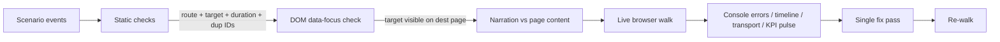

# Full Scenario / Page / Narrator Audit

## Context

The demo currently has:

| Section | Scenarios | Has presenter script |
|---|---:|---:|
| CIC | 10 | 0 |
| Digital | 31 | 0 |
| BSS | 33 | 0 |
| OSS | 16 | 0 |
| NOC | 8 | 8 |
| **Total** | **98** (90 unique IDs across catalog) | **8** |

Routes registered in [src/main.tsx](src/main.tsx): 106 (all 80+ scenario routes resolve cleanly — confirmed via `comm -23` on extracted route lists).

`data-focus` attributes in DOM: 16 distinct values. Scenarios reference 6 distinct `target:` strings (`page`, `kpi-strip`, `cic-incident`, `cic-grid`, `noc-agent`, `noc-actions`). Two DOM-side targets exist that no scenario uses (`cic-customer`, `cic-cohort`) — potentially dead, or potentially missing scenario references.

The narrator (`PresenterScript` in [src/data/presenterScripts.ts](src/data/presenterScripts.ts)) only covers 8 NOC scenarios. All other 82 scenarios run silent.

## What "right" means here

A scenario is correct end-to-end if all of:

1. **focus.route** exists in [src/main.tsx](src/main.tsx)
2. **focus.target** exists as a `data-focus` attribute on the destination page (or one of `page`, `kpi-strip` which exist on every section page after the recent edits)
3. **Event narration** describes something the user can see on the page it just landed on (e.g. an event that says "PE-LDN-1 BGP flap" should land somewhere that shows transport KPIs, not on `/oss/energy`)
4. **durationSec** >= max(atSec) so the timer doesn't truncate the last event
5. **Per-kind focus is consistent** — if a scenario has two `act-snow` beats, they should both make sense relative to each other
6. **The page itself is sane** — KPI strip present, headings non-empty, no truncated charts, no console errors

Flow:

## Implementation steps (read-only first, then a single fix pass)

### Phase 1 — Static audit (read-only, no edits)

1. **Inventory** — for each of the 90 scenarios extract: section, id, title, durationSec, max(atSec), event count, list of (atSec, kind, focus.route, focus.target). Output as a single table.
2. **Route check** — confirm every focus.route exists in [src/main.tsx](src/main.tsx). Already confirmed at preview-stage: only 5 mismatches and they're all `/customer/:id` parametrised matches. ALL CLEAN.
3. **Target check** — for each unique (route, target) pair, confirm the destination page exposes a `data-focus="<target>"` attribute. Two known suspect targets to investigate: `cic-cohort`, `cic-customer`. If a scenario points to a missing target the focus runtime falls back to the page top — not broken but the pulse animation won't fire.
4. **Duration check** — flag any scenario where `durationSec < max(atSec) + 1`. (We caught one of these in OSS earlier — durationSec 18 with events at atSec 34. Need to make sure we never re-introduced.)
5. **Duplicate ID check** — confirm 90 unique IDs.

### Phase 2 — Narrator coverage policy

Decide: expand presenter coverage to all sections (90 scripts × 4 lines each = ~360 narrator lines) OR scope to a representative subset (~25 highest-impact scenarios) OR document silent-by-design.

I will recommend in the plan: **scope to ~25** based on (a) every CIC scenario gets one (10), (b) every section's first 2-3 scenarios (~15), (c) NOC stays at 8. The rest run silent which is consistent with the current ScenarioTransport behaviour.

### Phase 3 — Per-scenario narration vs page-content audit

Walk each scenario's events and verify the narration matches the destination page's content. This is the most labour-intensive step. For example: a CIC event narrating "12,400 5G-handsets identified" focusing `/customers` is fine because `/customers` shows a customer list. The same narration focusing `/uplift` would be wrong because `/uplift` shows treatment uplift charts, not a list.

### Phase 4 — Live browser walk

For each section drive ONE representative scenario end-to-end via the live browser harness:

| Section | Scenario to walk |
|---|---|
| CIC | London 5G SA upgrade · Ravi Patel |
| Digital | Outage comms drafter |
| BSS | FCA Consumer Duty |
| OSS | B2B 5G slice activation · Barclays URLLC |
| NOC | London HSS · IMS registration storm |

Capture: console errors, URL trail, timeline progression, KPI pulse triggers.

### Phase 5 — Fix pass

ONE consolidated edit covering everything found in phases 1-4:
- Update [src/data/sectionScenarios.ts](src/data/sectionScenarios.ts) for any wrong route/target/duration/narration
- Add `data-focus` attributes to pages where a target is referenced but missing
- Add presenter scripts per phase-2 policy decision
- Run `tsc --noEmit` + `vite build` clean

### Phase 6 — Verification re-walk

Re-run the live walk on the same 5 representative scenarios to confirm zero defects.

## Verification

- `node node_modules/typescript/lib/tsc.js --noEmit` — exit 0
- `node node_modules/vite/bin/vite.js build` — clean build
- Live browser walk: 5 representative scenarios pass with 0 console errors and visited URLs match expected tour
- Spot-check 3 random scenarios per section after fix pass

## Critical Files

- [src/data/sectionScenarios.ts](src/data/sectionScenarios.ts) — 90 scenarios with focus events; will receive most fixes
- [src/data/presenterScripts.ts](src/data/presenterScripts.ts) — narrator coverage; expand for selected scenarios
- [src/components/app/FocusRuntime.tsx](src/components/app/FocusRuntime.tsx) — focus runtime that consumes scenario focus events
- [src/components/timeline/ScenarioTimeline.tsx](src/components/timeline/ScenarioTimeline.tsx) — timeline rendering on overview pages
- [src/main.tsx](src/main.tsx) — routes registry to validate against

## Question for you before I execute

The audit will find dozens of small narration / target mismatches. Two policy choices I need before the fix pass:

1. **Narrator scope** — expand to ~25 scenarios (recommended), all 90, or leave silent?
2. **Audit depth** — do you want the static audit + live walk only, or do you want me to actually click through *every step of every scenario* in the browser? The latter is ~4 hours of automation work; the former is ~1 hour.

I'll wait for the answer before starting the fix pass.