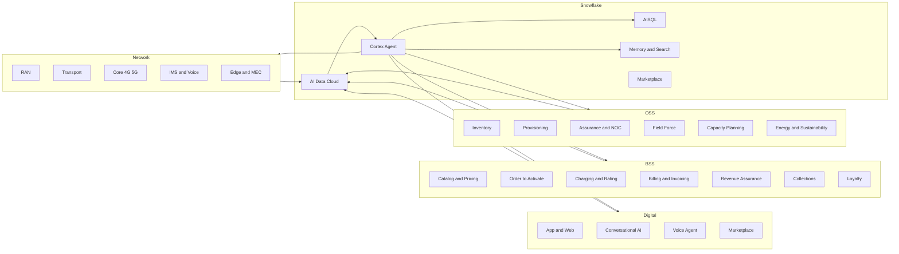

# Full telecom demo — gap analysis (Digital · BSS · OSS · Network)

## What we have today

| Domain | Surface today |
|---|---|
| Digital | Care chat (CIC), proactive care comms, SMS / push outreach, Briefing |
| BSS | Customer 360, Churn, Offers / NBA, Approvals, billing references (bill-shock scenario) |
| OSS | NOC Command Center, Incident Queue, Topology, Agent Runs, Event Stream |
| Network | RAN cluster congestion (MAN), gNB thermal (LIV), IPRAN (LDS), HSS/IMS (LDN) |
| AI / Agentic | Cortex Agent orchestration page, AISQL tool calls, agentic NOC sequencer |

This is excellent for **assurance + retention**. It is missing most of the **lifecycle**.

## What a full telco demo also needs

### A. Digital channels (consumer + enterprise)

1. **Self-service journeys**: My Account / app — plan view, top-up, add-on purchase, eSIM provisioning. Surface a small "in-app journey simulator" page that shows a customer adding a Roaming Pass and the agent personalising the offer.
2. **Web / app analytics**: Adobe Analytics or Snowplow events; ICX (in-context experience) personalisation.
3. **Channel orchestration**: SMS / push / email / WhatsApp / RCS, with consent + frequency caps and Ofcom marketing rules. Today we send "SMS to 89 customers" — but no channel orchestrator view.
4. **Voice biometric / AI agent**: an inbound voice call routed to a Cortex Voice agent, with intent classification + sentiment + next-best-action.
5. **Conversational AI for chat**: deflect → assist → escalate flow with the same Cortex Agent stack.
6. **Marketplace / partner**: third-party content bundles (Disney+ / Netflix / Spotify), entitlement provisioning.

### B. BSS — full revenue lifecycle

1. **Product catalog & rate-plan engine**: TM Forum SID-aligned; show creating a new "5G SA Unlimited Max" plan and pushing it to all channels.
2. **Order-to-Activate (O2A)**: order capture → credit check → fraud check → SIM/eSIM activation → first-bill — end to end.
3. **Charging & rating**: real-time online charging (OCS), pre-paid balance, post-paid usage; visualise a roaming session being rated against a Roaming Pass.
4. **Billing**: bill cycle generation, invoice PDF preview, dunning workflow, dispute handling, **Ofcom auto-compensation** evaluation (we mentioned but did not show).
5. **Revenue assurance**: leakage detection between mediation → rating → billing, fraud (IRSF, Wangiri, SIM-box) detection scenario.
6. **Collections & credit**: dunning, payment plan offer, write-off, dispute resolution.
7. **B2B / Enterprise BSS**: account hierarchies, MSA, SLA credits, custom rate plans, e-bonding.
8. **Loyalty & rewards**: Vodafone VeryMe / EE Stuff equivalent — a loyalty scenario.

### C. OSS — full assurance + fulfilment lifecycle

1. **Inventory (Logical + Physical)**: cross-domain (RAN, transport, core, IT, leased lines, dark fibre) — TM Forum TMF640/TMF638 surface. Today we have topology but not inventory or numbering plans.
2. **Service activation / fulfilment**: provisioning workflow (e.g. enterprise leased line: order → site survey → install → handover) — to complement the assurance side.
3. **Numbering / IMSI / IMEI / MSISDN management**: SIM/eSIM lifecycle; a fraud scenario with IMSI cloning.
4. **Field force management**: dispatch, work orders, parts, SLA — already implied in Liverpool (field tech ETA 32m) but with no FFM view.
5. **Capacity & demand planning**: 12-month capacity outlook, what-if simulation, RAN expansion planning, transport upgrade planning.
6. **Performance & QoE**: end-to-end QoE per service (VoLTE MOS, video MOS, gaming RTT), per-cell drilldown, customer-experience score → ticket.
7. **Test & turn-up automation**: gNB integration tests, drive-test ingest.
8. **Power, environmental, energy**: site energy / kWh / CO₂ — hot topic for telcos. Show a green-NOC view with an "energy sleep mode" agent action.
9. **Spectrum management & licences**: spectrum band view; only relevant to high-end Ofcom / regulator demos.
10. **OSS for B2B SD-WAN / SASE**: managed enterprise services with a tenant view.

### D. Network — additional incident shapes

(in addition to the 4 we already script)

1. **HSS/UDM cluster outage** (have it).
2. **PCRF/PCF policy mis-push** — wrong throttle pushed to live, customers throttled at 64 kbps. Auto-rollback.
3. **Roaming partner outage** — GRX/IPX failure with one partner; visualise the inbound roamer impact and selective failover.
4. **Mains / battery exhaustion / generator** at a tower — multi-cell dark, energy + RAN combined.
5. **DDoS at SBC / public-facing IMS** — security blend with incident response.
6. **VoLTE → 5G SA migration regression** — mid-call drops because of slice misconfig.
7. **MEC / edge-compute** workload incident (low-latency gaming or private 5G campus).
8. **Submarine / national-fibre cut** — multi-region incident with cross-domain coordination.

### E. Cross-cutting layers

1. **Trust, Privacy, Compliance**: GDPR DSAR, Article 22 automated-decision override, Ofcom General Conditions of Entitlement.
2. **Security & Fraud**: SIM-swap fraud, account takeover, IRSF, robocall/STIR-SHAKEN.
3. **Sustainability**: kWh, CO₂, energy SLA, energy-aware RAN sleep.
4. **FinOps for telco**: per-warehouse / per-pipeline cost; per-incident cost-to-serve.
5. **Data Mesh / Data Products**: TMF data product catalogue (customer 360, network KPIs, finance) — useful when pitching Snowflake's data-product story.
6. **Federated learning / privacy-preserving analytics** for partner/MVNO scenarios.
7. **TMF Open APIs**: TMF 620 (Product Catalog), TMF 622 (Product Ordering), TMF 632 (Party), TMF 637 (Product Inventory), TMF 638 (Service Inventory), TMF 641 (Service Ordering), TMF 645 (Trouble Ticket). Show one or two endpoints.

### F. Demo orchestration meta

1. **Demo script chooser** that lets a presenter pick the storyline (Retention / Acquisition / Care / NOC / Fraud / Sustainability) instead of clicking around.
2. **Persona view**: same data, different lens (CMO / CTO / CFO / Care VP / Regulator). One toggle re-skins the dashboard.
3. **"Without agentic AI vs With" side-by-side** — explicit before/after MTTR, contact rate, CSAT, ARPU.
4. **Mobile / iPad layout** — execs viewing the demo on a tablet.

## Architectural picture (target)

## Phased build plan (sequenced for "demo-ready" priority)

### Phase 1 — close the most glaring gaps (1–2 days each)
- Add **Order-to-Activate** mini-page (BSS lifecycle): card-based wizard with a Cortex agent doing credit + fraud + eSIM + first-bill. Resolves the "no acquisition story" gap.
- Add **Channel Orchestrator** view (Digital): shows multi-channel reach (SMS/push/email/RCS) with consent + frequency cap state per customer. Already half-implemented in retention narrative.
- Add **Ofcom auto-compensation** flow + **GDPR Art.22 override** explicit screen — both already referenced but not shown.
- Add **Fraud (SIM-swap)** scenario — a new NOC sequence + decision tree (block, step-up auth, contact customer, write-off).

### Phase 2 — extend lifecycles (3–5 days)
- **BSS Billing & Charging**: invoice preview, real-time charging meter, dispute resolution flow.
- **OSS Inventory**: TMF 638-aligned service-inventory tree (customer → service → resource), with an enterprise leased-line example.
- **Capacity Planner**: 12-month outlook with a "what-if" agent.
- **Field Force**: work-order list view that the Liverpool incident already implies.

### Phase 3 — the "wow" demos (1 week)
- **Voice agent**: simulated inbound call with live transcript, sentiment, NBA, escalation. Hooked into the same Cortex Agent.
- **B2B / Enterprise tenant view**: account hierarchy, custom SLA, MSA credits.
- **Energy & Sustainability NOC**: green KPIs, RAN energy-saving agent action.

### Phase 4 — the differentiators (1 week+)
- **Roaming partner failure** scenario — multi-vendor + selective failover.
- **MEC / private 5G campus** demo for B2B story.
- **Persona view** toggle (CMO / CTO / CFO / Care VP / Regulator).
- **TMF Open API** widget — show 1 GET / 1 POST against a TMF 620 endpoint.
- **"Without vs With agentic AI" side-by-side** view.

## What not to build (yet)
- Full TMF SID-mapping engine (overkill for a demo).
- Real spectrum-management surface (regulator-only audience, low fan-out).
- Full Service-Order Capture in B2B (very vertical-specific).
- Real-money payment integration.

## Open questions for the user
- Which **one phase** should we ship first? My recommendation: **Phase 1 (Order-to-Activate + Channel Orchestrator + Fraud scenario)** because it converts this from an assurance-only demo into an end-to-end one.
- Audience: are we targeting **CTO / NOC**, **CMO / Care**, or **CFO / Strategy**? It changes which Phase 2/3 items to prioritise.
- Should new pages live under `/noc/*` (and we rename the section "Operations") or get their own top-level (`/digital`, `/bss`, `/oss`)?
- Keep mock-only, or wire one or two flows to real Snowflake objects (Cortex Search, AISQL on a sample dataset, a TMF API stub) to give the demo "live" credibility?
