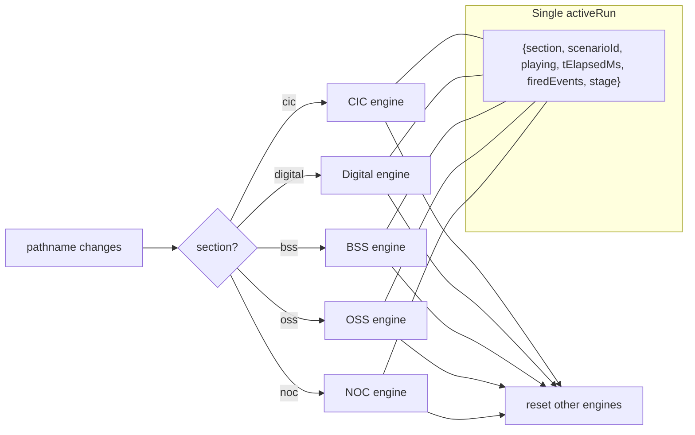

# Per-section scenarios

## Context

Today the codebase has **one global scenario engine** in [src/state/DemoStateProvider.tsx](src/state/DemoStateProvider.tsx) keyed by `selectedIncidentId`. Eight scripts in [src/data/nocSequence.ts](src/data/nocSequence.ts) fan events into `firedEvents`, which Digital/BSS/OSS pages consume via `<InSyncBanner>` ([src/components/shared/InSyncBanner.tsx](src/components/shared/InSyncBanner.tsx)). CIC has a separate scenario engine ([src/data/scenarios.ts](src/data/scenarios.ts)) auto-synced via [src/data/incidentToCic.ts](src/data/incidentToCic.ts).

The user wants the opposite model:
- Each section has its own catalog of scenarios.
- A scenario only runs while the user is on that section's pages.
- Leaving the section stops and resets the run.
- Cmd-K Run shows only the current section's scenarios.
- No more cross-domain fan-out.

## Architecture



**Single shared engine, scoped by section** (cleaner than five duplicates):
- One `activeRun` object in state with `{section, scenarioId, playing, tElapsedMs, firedEvents, stage}`.
- Each scenario carries a `sectionId` field.
- A `useEffect` on `pathname` derives the current section; if `activeRun.section !== currentSection` the run is wiped.
- Cmd-K, sidebar dropdown, ScenarioTransport, and Narrator all read the same `activeRun` and the section-filtered catalog.

## Scenario catalogs (proposed content)

| Section | Scenarios |
|---|---|
| **CIC** | Manchester churn save, Birmingham bill-shock wave, Leeds SnowFlex price competition, London 5G upgrade opportunity (the existing 4 — kept as-is, moved under CIC) |
| **Digital** | (1) Care chat deflection — CUST-001 Manchester service issue, (2) Voice save-the-cancel — CUST-001, (3) eSIM activation funnel — onboarding burst, (4) Roaming Pass enrol — proactive push wave, (5) Marketplace bundle NBA — Disney+ attach |
| **BSS** | (1) Catalog publish — 5G SA Unlimited Max launch, (2) Monthly billing cycle close — disputes & auto-comp, (3) OCS live charging — roaming session, (4) Dunning recovery — D+30 wave, (5) Revenue assurance — IRSF detection, (6) Loyalty mission launch |
| **OSS** | (1) Provisioning — B2B leased-line activation, (2) Field-force dispatch — Liverpool fan replacement, (3) Capacity what-if — Manchester upgrade ROI, (4) Energy-save automation — NYK rural site, (5) Inventory drift reconciliation |
| **NOC** | The existing 8 agentic incidents (Manchester M14, Liverpool L1, Leeds LS2, London HSS, Single SIM-swap, Roaming, Mass SIM-swap, NYK Mains) — moved here, no fan-out |

## Implementation steps

1. **New typed catalog** at `src/data/sectionScenarios.ts`:
   ```ts
   type SectionId = 'cic'|'digital'|'bss'|'oss'|'noc';
   interface SectionScenario {
     id: string; sectionId: SectionId; title: string;
     subtitle: string; durationSec: number;
     events: SeqEvent[]; presenter?: PresenterScript;
   }
   export const sectionScenarios: SectionScenario[] = [...];
   export const scenariosFor = (s: SectionId) => sectionScenarios.filter(x => x.sectionId === s);
   ```
   Move all 8 NOC scripts here unchanged (sectionId='noc'). Author the new Digital/BSS/OSS/CIC scenarios — reuse existing event-kind taxonomy from [src/data/nocSequence.ts](src/data/nocSequence.ts).

2. **Refactor DemoStateProvider** ([src/state/DemoStateProvider.tsx](src/state/DemoStateProvider.tsx)):
   - Replace `selectedIncidentId`, `nocPlaying`, `tElapsedMs`, `firedEvents`, `currentStage` with one `activeRun` reducer.
   - Add `currentSection` derived from `useLocation().pathname` (lifted into AppShell or a small route-aware wrapper that calls a setter).
   - Add an effect: `if (activeRun.scenario && scenarioFor(activeRun.scenario).sectionId !== currentSection) reset()`.
   - `selectScenario(id)` infers section from the scenario; if section differs from current path, navigate to the section first.
   - Keep `playSpeed`, sound, narrator settings unchanged.

3. **Sidebar** ([src/components/app/Sidebar.tsx](src/components/app/Sidebar.tsx)):
   - One dropdown per section, fed by `scenariosFor(currentSection)`.
   - Drop the dual CIC/incident dropdowns and the helper text about ⌘K cross-section behaviour.

4. **CommandPalette** ([src/components/app/CommandPalette.tsx](src/components/app/CommandPalette.tsx)):
   - Title becomes "Run a {Section} scenario".
   - Filter `nocIncidents` source → use `scenariosFor(currentSection)`.
   - Empty state on a section with no defined scenarios (won't happen with the proposed catalogs but guard anyway).

5. **ScenarioTransport** ([src/components/app/ScenarioTransport.tsx](src/components/app/ScenarioTransport.tsx)):
   - Read from `activeRun`. If `activeRun.section !== currentSection` (transient during navigation) it should already be wiped.
   - Headline shows `{Section} · {Scenario title}` instead of `{City}`.
   - Hide entirely if no scenario is selected for the current section (no global "Pick a scenario from anywhere" affordance any more — Cmd-K is per-section).

6. **Narrator** ([src/components/narrator/Narrator.tsx](src/components/narrator/Narrator.tsx)):
   - Drop the `domainNotes` per-domain switching — there's no cross-section traversal.
   - Read `presenter` directly from the active scenario.
   - Drop the "CIC fallback narration" branch.

7. **Remove cross-domain plumbing**:
   - Delete [src/components/shared/InSyncBanner.tsx](src/components/shared/InSyncBanner.tsx) and its callers in `DigitalOverview`, `BssOverview`, `OssOverview` overview pages.
   - Delete [src/data/scenarioCoverage.ts](src/data/scenarioCoverage.ts), [src/data/incidentToCic.ts](src/data/incidentToCic.ts), and the `coverageFor` reads in CommandPalette / Settings.
   - Replace the now-removed banner area with a small per-section "Scenario running" pill (just shows scenario title + transport progress) so the page still has a clear "live" cue.

8. **CIC pages**:
   - [src/pages/CommandCenter.tsx](src/pages/CommandCenter.tsx) drops the `incidentHasCicFocus` banner. The 4 CIC scenarios fully drive the page (they always have a primary customer).
   - Keep the existing CIC stage machine; wire it through the new `activeRun` (CIC scenarios advance via stage events, NOC/Digital/BSS/OSS scenarios via timed `SeqEvent`).

9. **Settings demo catalogue** ([src/pages/Settings.tsx](src/pages/Settings.tsx)):
   - Group by section. Each section has its own card list pulled from `sectionScenarios.filter(...)`.
   - Drop the cross-domain coverage chip (no longer applies).

10. **Routing/navigation glue**:
    - Selecting a scenario whose section differs from the current pathname → `navigate(sectionToPath[section])` then start.
    - Removing scenarioId from URL is fine — keep it in localStorage per section so the demo remembers the last scenario chosen per section.

## Verification

1. `node node_modules/typescript/lib/tsc.js --noEmit` — clean.
2. `node node_modules/vite/bin/vite.js build` — clean.
3. Manual:
   - On `/cic`, sidebar shows 4 CIC scenarios. Pick "Manchester churn save", press Play, transport runs.
   - Click a Digital sidebar link. Transport disappears immediately. Sidebar now shows Digital scenarios. No leftover state.
   - Cmd-K on `/digital` lists Digital-only scenarios. Run "Care chat deflection". Switch to `/bss` — Digital run is gone.
   - On `/noc`, all 8 incidents listed. Run "London HSS". Verify Digital/BSS/OSS pages show NO banner anymore even mid-script (fan-out gone).
   - Verify localStorage remembers last scenario picked per section across reloads.

## Critical files

- [src/state/DemoStateProvider.tsx](src/state/DemoStateProvider.tsx) — biggest refactor; new `activeRun` reducer + section-aware reset effect.
- [src/data/sectionScenarios.ts](src/data/sectionScenarios.ts) (new) — single source of truth for the per-section catalog and presenter beats.
- [src/components/app/Sidebar.tsx](src/components/app/Sidebar.tsx) — picker reads `scenariosFor(currentSection)`.
- [src/components/app/CommandPalette.tsx](src/components/app/CommandPalette.tsx) — filter by current section.
- [src/components/app/ScenarioTransport.tsx](src/components/app/ScenarioTransport.tsx) — render only when current section has an active run.

## Notes / tradeoffs

- This is a **breaking change** for the demo flow you've used so far. The fan-out story ("watch the NOC orchestrator drive Digital + BSS + OSS in sync") is gone — that was a strong narrative. If you ever want it back, NOC could optionally have a separate "cross-domain incident" mode flagged on certain scenarios.
- 5 × ~5 = ~25 scenarios total. I'll author short, plausible scripts (10-25 events each) following the same vocabulary as today (real vendors: Salesforce, Amdocs CES, Ericsson ENM, ServiceNow, etc.).
- Old data files (`nocSequence.ts`, `nocIncidents.ts`, `presenterScripts.ts`, `scenarios.ts`, `scenarioCoverage.ts`, `incidentToCic.ts`) are consolidated into `sectionScenarios.ts`. Will keep imports working temporarily by re-exporting from the new file, then delete in a follow-up.
- Out of scope this round: the standalone `/events` and `/network` pages — they currently read `firedEvents` globally. They'll keep working but only show events from the currently-running section's scenario.
