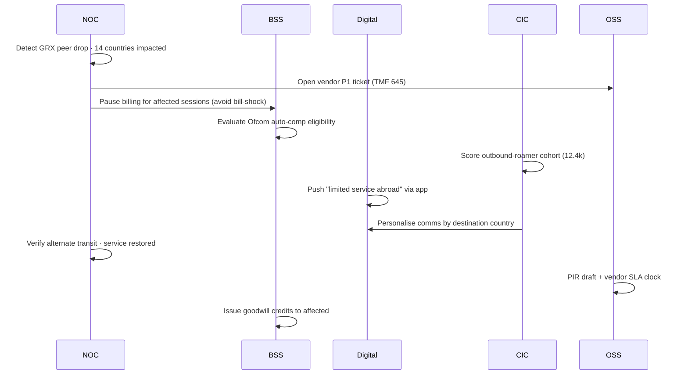

# Scenario catalogue — what would actually make sense

## Lens
A "good" telco demo scenario should:
1. Touch ≥ 2 domains (otherwise it belongs in one tile, not the whole platform).
2. Be recognisable to an MNO ops/exec audience (mirrors something they've lived through).
3. Have a believable agentic outcome (closed-loop, governed, faster than human-only).
4. Stress one of the Snowflake-native pillars (streaming KPIs, AISQL, Cortex Search RAG, Cortex Agents, governance/audit, Iceberg, Marketplace).

I scored each candidate **demo value** (visual punch + audience recognition) and **breadth** (number of domains it credibly touches).

## Catalogue

### Already shipped
| # | Scenario | Domains | Notes |
|---|---|---|---|
| 1 | Manchester M14 RAN congestion | NOC | Hero NOC story, ready to fan out |
| 2 | Liverpool L1 thermal | NOC | Single-cell, fast resolve |
| 3 | Leeds LS2 IPRAN ring | NOC | Transport, vendor escalation |
| 4 | London IMS HSS storm | NOC | High-impact regulator-grade |
| 5 | SIM-swap (single customer) | NOC + BSS | Security flavour |

### Highest-recommended new (build now)

| # | Scenario | Domains | Demo value | Breadth | Why |
|---|---|---|---|---|---|
| 6 | **Roaming partner outage (GRX/IPX)** | NOC · BSS · Digital · CIC · OSS | 9 | 5 | Best fan-out in the whole catalogue. Foreign roamers stop registering, outbound roamers lose data. Touches billing pause, proactive comms, vendor escalation, customer goodwill. |
| 7 | **Mass SIM-swap fraud campaign** | BSS · Digital · NOC · CIC · OSS | 9 | 5 | Builds on existing single-customer scenario. 47 swaps in 18 min from same call-centre operator → BSS freezes, Digital steps up MFA per postcode, CIC orchestrates Care callbacks, OSS opens HR/fraud incident. Very current topic (UK FCA/Ofcom focus). |
| 8 | **Ofcom auto-compensation wave** | BSS · CIC · OSS · NOC | 8 | 4 | Multi-cell outage exceeds 2h Ofcom GC C7 threshold → BSS auto-evaluates eligibility, CIC personalises apology, OSS triggers PIR, NOC closes loop. Regulator-grade story. |
| 9 | **Tower mains failure + battery exhaustion** | NOC · OSS · CIC · Digital | 8 | 4 | Rural North Yorkshire site, mains drops, 3h battery countdown, generator dispatch. Visually dramatic with countdown timer. Sustainability angle (energy + CO₂). |
| 10 | **Enterprise 5G slice SLA breach (B2B)** | OSS · NOC · BSS · CIC | 7 | 4 | URLLC slice latency p99 breaches 10ms contractual SLA for a B2B tenant. NOC reroutes, BSS computes SLA credits per MSA, CIC drafts exec briefing. Opens the B2B/private 5G story. |

### Strong second tier (backlog)

| # | Scenario | Domains | Demo value | Breadth | Why |
|---|---|---|---|---|---|
| 11 | **PCRF/PCF policy mis-push** | NOC · BSS · Digital | 7 | 3 | Wrong throttle pushed to live → customers throttled to 64 kbps. Auto-rollback in 90s. Shows agent guardrails + reversibility. |
| 12 | **Marketing-campaign over-targeting → bill-shock cascade** | Digital · CIC · BSS · OSS | 7 | 4 | A "use-it-or-lose-it" SMS hits 22k high-overage customers, usage spikes, complaints surge. Digital agent halts campaign mid-flight. RA opens leakage ticket. |
| 13 | **Credit-bureau outage during O2A** | BSS · Digital · CIC · OSS | 6 | 4 | Experian API down 38 min. BSS fails over to Equifax with stricter risk model. Digital surfaces "checking" message. Acquisition continues. |
| 14 | **STIR/SHAKEN robocall storm** | NOC · CIC · Digital · BSS | 7 | 4 | Spoofed-number storm hits SBC. NOC throttles, Digital pushes "suspicious-call alert", BSS suspends Wangiri call-back fraud billing. Hot regulatory topic (US/UK). |
| 15 | **VoLTE → 5G SA migration regression** | NOC · OSS · CIC | 6 | 3 | Mid-call drops because of slice-misconfig after a SW push. Auto-rollback. Shows software lifecycle agent. |
| 16 | **Submarine / national-fibre cut** | NOC · OSS · BSS · CIC | 8 | 4 | Multi-region outage with cross-domain coordination. Big incident command theatre. |
| 17 | **DDoS on SBC / public IMS** | NOC · OSS · BSS · CIC | 7 | 4 | Security blend with incident response. Rate-limit + scrubbing-centre divert. |
| 18 | **MEC / private 5G campus incident** | OSS · NOC · BSS · Digital | 7 | 4 | Edge compute workload incident on a manufacturing private-5G tenant. Opens the B2B/MEC narrative. |

### Niche / role-specific (deprioritise unless audience requires)

| # | Scenario | Domains | Why later |
|---|---|---|---|
| 19 | Spectrum-licence / regulator query | OSS · CIC | Regulator-only audience. |
| 20 | Real-money payment integration failure | BSS | Single-domain, low fan-out. |
| 21 | Full TMF SID-mapping demo | OSS · BSS | Architect-only, no narrative. |
| 22 | Federated learning across MVNOs | OSS · BSS | Niche partner story. |
| 23 | Spectrum-sharing dynamic auction | OSS · BSS | UK Ofcom-only relevance. |

## Recommended shortlist for next iteration

**Build these 3 alongside the existing 5:**
1. **Roaming partner outage** (#6) — broadest fan-out; great for showing every domain reacting in lockstep. Ofcom + GSMA hooks.
2. **Mass SIM-swap fraud** (#7) — security flavour; current; extends existing single-customer flow.
3. **Tower mains failure + battery countdown** (#9) — visually dramatic countdown timer; sustainability angle for ESG conversations.

This gives 8 scenarios total, covering: RAN, transport, IMS core, security/fraud, energy/site, regulator/Ofcom — i.e. every part of the telco surface a senior architect would expect to see exercised.

**Defer the rest to a backlog** — pick from #8 / #10 / #14 / #16 once the 3 are live, depending on who's in the room (CFO ↦ #8 Ofcom auto-comp, CTO ↦ #14 STIR/SHAKEN or #16 fibre cut, B2B Sales ↦ #10 enterprise SLA).

## Mapping to Snowflake-native pillars
For each shortlisted scenario, identify what it stresses:

| Scenario | Streaming | AISQL | Cortex Search | Cortex Agents | Governance | Iceberg / Open |
|---|---|---|---|---|---|---|
| Manchester M14 | yes | yes | yes (runbooks) | yes | yes | — |
| Liverpool thermal | yes | — | yes (TSB) | yes | — | — |
| Leeds IPRAN | yes | — | — | yes | yes (CAB) | — |
| London IMS HSS | yes | yes | yes (vendor advisory) | yes | yes (Ofcom) | — |
| SIM-swap (single) | yes | yes (fraud signals) | yes (CTI feed) | yes | yes (audit chain) | yes (CTI sharing) |
| **Roaming partner** (#6) | yes | yes (cohort) | — | yes | yes (Ofcom) | yes (TAP3.12 partner files) |
| **Mass SIM-swap** (#7) | yes | yes (fraud cohort) | yes (operator pattern) | yes | yes (HR/audit) | yes (CTI / GSMA T-ISAC) |
| **Tower mains** (#9) | yes | — | yes (energy SOP) | yes | — | — |

That spread covers every Snowflake-native pillar at least twice across the 8 scenarios.

## Cross-domain scenario flow (illustrative — Roaming partner outage)

## Open questions for the user
- **Q1 — Shortlist**: ship the 3 recommended (Roaming · Mass SIM-swap · Tower mains)? Or swap one out for #8 (Ofcom auto-comp) or #14 (STIR/SHAKEN)?
- **Q2 — Audience focus**: who is the next demo for? Tells me whether to emphasise Regulator (#8/#14), B2B (#10/#18), Security (#7/#14/#17), or Energy/ESG (#9).
- **Q3 — Depth**: each new scenario can be (a) a 25-40s scripted timeline like Manchester, or (b) a lighter "executive recap" (numbers + brief narrative) that is faster to build. Recommendation: full timeline for Roaming + SIM-swap, lighter recap for Tower-mains.
- **Q4 — Scenario tagging**: should each scenario carry tags (Regulator · ESG · Security · B2B · Acquisition) so a presenter can filter? Useful only if catalogue grows past ~10.
