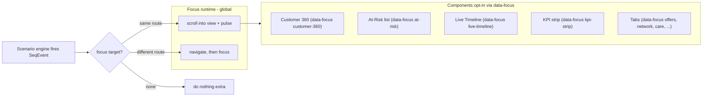

# Scenario-driven UI focus

## Context

Each scenario in [src/data/sectionScenarios.ts](src/data/sectionScenarios.ts) is a list of `SeqEvent` objects fired over time by [src/state/DemoStateProvider.tsx](src/state/DemoStateProvider.tsx). Today the events update the in-card text (Live timeline, narrator) but never *steer* the user's eye to the relevant card or sub-page.

Goal: when a beat fires (e.g. *"Customer 360 opened for Grace Williams"*), the UI either navigates to the matching sub-page or scrolls + highlights the card on the current page.

## Architecture



## Step 1 — Add an optional `focus` field to `SeqEvent`

[src/data/nocSequence.ts](src/data/nocSequence.ts):

```ts
export interface SeqEvent {
  atSec: number;
  kind: SeqEventKind;
  category?: ...;
  severity?: ...;
  text: string;
  // NEW
  focus?: {
    target: string;        // panel id, e.g. "customer-360", "at-risk", "kpi:save-actions"
    route?: string;        // optional /route to navigate first
    tab?: string;          // optional tab id within the panel (e.g. "offers")
    hold?: number;         // optional ms to keep highlight (default 1500)
  };
}
```

This is purely additive — old events keep working.

## Step 2 — Annotate every scenario in [src/data/sectionScenarios.ts](src/data/sectionScenarios.ts)

For each of the ~28 scenarios I'll add a `focus` to the meaningful beats. Examples:

**CIC · Leeds price competition (cic-leeds-snowflex)**
- T+0 *PAC-request volume +340%* → `focus: { target: 'kpi:p1' }`
- T+4 *Cohort: 940 active PAC* → `focus: { target: 'at-risk' }`
- T+6 *Grace Williams scored 69%* → `focus: { target: 'customer-360', route: '/customer/CUST-005' }`
- T+8 *NBA retention offer* → `focus: { target: 'customer-360', tab: 'offers', route: '/customer/CUST-005' }`
- T+12 *Salesforce Service Cloud — modal + email* → `focus: { target: 'live-timeline' }`
- T+19 *Verify, projected churn −16pp* → `focus: { target: 'kpi:save-actions' }`
- T+21 *Resolve* → `focus: { target: 'live-timeline' }`

**NOC · London HSS** — beats route between `/noc` (alarm storm), `/noc/agents` (reasoning), `/noc/topology` (topology view), `/noc/agent-runs` (audit).

**Digital · Care chat deflection** — beats focus the chat thread, then the intent panel, then the tool-call list.

**BSS · Live OCS charging** — beats focus the live charging meter, then the policy enforcement card, then the rate-plan tariff.

**OSS · Field-tech dispatch** — beats focus the work-orders table, then dispatch optimiser, then the resolved-state KPIs.

I'll author all ~28 scenarios in one pass — each adds 4-7 focus tags.

## Step 3 — Panel registration

A tiny convention for components: add `data-focus="<id>"` (and optionally `data-focus-tab="..."`) to any element you want a beat to be able to target.

Concrete additions (about 12-15 cards):
- `[src/components/timeline/LiveTimeline.tsx](src/components/timeline/LiveTimeline.tsx)` → `data-focus="live-timeline"`
- `[src/components/customer360/Customer360.tsx](src/components/customer360/Customer360.tsx)` → `data-focus="customer-360"` plus `data-focus-tab="overview|churn|network|care|usage|offers"` on each tab
- `[src/components/customers/AtRiskCustomerList.tsx](src/components/customers/AtRiskCustomerList.tsx)` → `data-focus="at-risk"`
- `[src/pages/CommandCenter.tsx](src/pages/CommandCenter.tsx)` `<KpiStrip>` → `data-focus="kpi-strip"`; each tile gets `data-focus="kpi:impacted"`, `kpi:p1`, `kpi:save-actions`, `kpi:risk-reduction`
- NOC: alarm queue (`data-focus="alarm-queue"`), agent reasoning (`data-focus="agent-reasoning"`), action tray (`data-focus="action-tray"`)
- Digital: chat thread (`data-focus="chat-thread"`), tool calls (`data-focus="tool-calls"`)
- BSS: catalog table, charging meter, dunning funnel, fraud table, etc.
- OSS: provisioning queue, work-order list, capacity table, energy regional bars

The components don't need to know about scenarios — they just expose a hook.

## Step 4 — `FocusRuntime` global component

New file: `src/components/app/FocusRuntime.tsx`. Mounted once in [src/components/app/AppShell.tsx](src/components/app/AppShell.tsx) next to `Narrator` / `ScenarioTransport`.

```ts
function FocusRuntime() {
  const { firedEvents, focusEnabled } = useDemoState();
  const navigate = useNavigate();
  const { pathname } = useLocation();
  const last = firedEvents[0];

  useEffect(() => {
    if (!focusEnabled || !last?.focus) return;
    const { target, route, tab, hold = 1500 } = last.focus;
    const apply = () => {
      const el = document.querySelector(`[data-focus="${target}"]`) as HTMLElement | null;
      if (!el) return;
      el.scrollIntoView({ behavior: 'smooth', block: 'center' });
      el.classList.add('focus-pulse');
      setTimeout(() => el.classList.remove('focus-pulse'), hold);
      if (tab) {
        const tabBtn = el.querySelector(`[data-focus-tab="${tab}"]`) as HTMLElement | null;
        tabBtn?.click();
      }
    };
    if (route && route !== pathname) {
      navigate(route);
      // wait one tick for new page to render before focusing
      setTimeout(apply, 80);
    } else {
      apply();
    }
  }, [last?.fid]);

  return null;
}
```

Add a `.focus-pulse` keyframe class in [src/index.css](src/index.css) — a 1.5s ring-flash:

```css
@keyframes focusPulse {
  0%   { box-shadow: 0 0 0 0 rgba(225, 29, 72, 0.55); }
  100% { box-shadow: 0 0 0 18px rgba(225, 29, 72, 0); }
}
.focus-pulse { animation: focusPulse 1.5s ease-out 1; outline: 2px solid var(--vfRed, #E11D48); outline-offset: 4px; }
```

## Step 5 — State + transport toggle

[src/state/DemoStateProvider.tsx](src/state/DemoStateProvider.tsx):
- Add `focusEnabled: boolean` (default true), persisted in `snowtelco.focus` localStorage.
- Add `setFocusEnabled(b)`.

[src/components/app/ScenarioTransport.tsx](src/components/app/ScenarioTransport.tsx):
- New small toggle next to the speed selector — Target icon, two states. When off the toggle goes muted; tooltip *"Auto-focus off — script won't move the page for you"*.

## Step 6 — Verification

1. `node node_modules/typescript/lib/tsc.js --noEmit` clean.
2. `node node_modules/vite/bin/vite.js build` clean.
3. Manual:
   - On `/command-center`, run *Leeds price competition*. Watch the page: at T+6, scroll snaps to Customer 360, Customer 360 panel pulses, route changes to `/customer/CUST-005`. At T+8 the Offers tab inside Customer 360 selects automatically.
   - Toggle auto-focus off in the transport bar — re-run scenario, page stays put.
   - Run *London HSS* on NOC: beats route between Command Center → Agent Orchestration → Topology → Agent Runs as the script progresses.
   - Run a Digital, BSS, OSS scenario in turn — each highlights its own panels.

## Tradeoffs / risks

- The number of focus tags is ~150 across all scenarios. Authoring them is the bulk of the work; runtime is small.
- Auto-navigation between routes can feel jumpy at high speeds. The transport bar already has a 0.25× speed; route hops will be readable at 0.5× and slower. At 4× they'll feel like a flash; presenters should pick a slower speed when demoing focus.
- If a panel isn't on screen yet (e.g. KPI not yet populated), `data-focus` will still resolve to its placeholder card. Acceptable — better than missing the beat.
- Out of scope: animated transitions between routes, prefetching, custom focus shapes per panel.

## Critical files

- [src/data/sectionScenarios.ts](src/data/sectionScenarios.ts) — add `focus` to ~150 events across 28 scenarios.
- [src/data/nocSequence.ts](src/data/nocSequence.ts) — extend `SeqEvent` interface with optional `focus`.
- [src/components/app/FocusRuntime.tsx](src/components/app/FocusRuntime.tsx) (new) — fire navigation + scroll + highlight.
- [src/state/DemoStateProvider.tsx](src/state/DemoStateProvider.tsx) — `focusEnabled` state + localStorage.
- [src/components/app/ScenarioTransport.tsx](src/components/app/ScenarioTransport.tsx) — toggle button.
</parameter>
