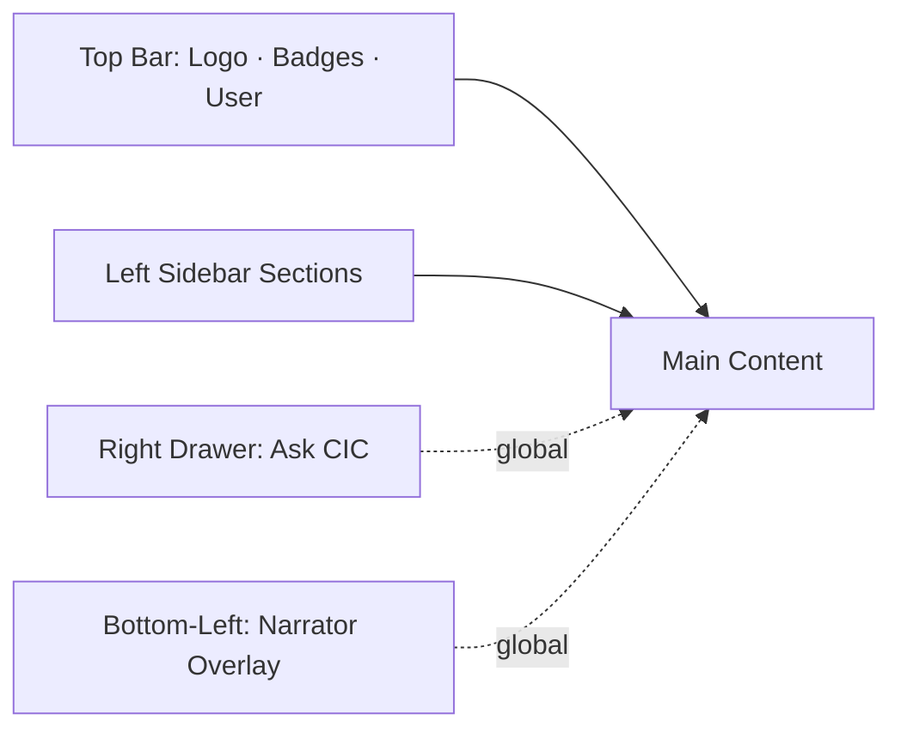

# Plan: VodafoneThree CIC v2 — All 18 Enhancements, Reorganized

## Context

The existing app already has a state machine (`useDemoState`) that drives every panel from a single source. Adding 18 features without restructuring would overload the current layout. So this plan does two things at once:

1. **Reorganize navigation** so each new feature has a natural home.
2. **Implement all 18 features** as small, isolated components plugged into the new layout.

Existing patterns to preserve:
- All data hardcoded in `src/data/*.ts`
- One global `DemoStateProvider` drives everything; new features extend it (sounds, theme, narrator, scenario)
- Vodafone-red accent, white/grey, executive feel — extend, don't dilute
- ECharts + Framer Motion + Sonner stay; no new heavy deps

## New information architecture

A persistent **left sidebar** appears on every page except `/`. The top bar keeps logo, badges, user. Sidebar groups:

```
OPERATIONS
  • Command Center            (live ops dashboard)
  • Network Map               (full-screen map + self-healing)
  • Event Stream              (scrolling NOC feed)

DECISIONING
  • At-Risk Customers         (full-page list with filters)
  • Customer 360              (current selected)
  • Compare Customers         (cohort drawer page)
  • Approval Workflow         (campaign approval modal hub)

ANALYTICS
  • Executive Insights        (KPIs, sparklines, counterfactual)
  • Treatment Uplift          (uplift visualisation)
  • Briefing Export           (PDF-ready summary)

ARCHITECTURE
  • Snowflake Blueprint       (existing /architecture)
  • Decision Lineage          (lineage popovers + table)

ASK CIC                       (Cortex AI chat sidebar - global, always-available)
SETTINGS                      (theme, sound, scenario, shortcuts help)
```

Top of `/command-center` gets a sub-tab strip: **Live Ops · Map · Insights · Customer**, so the page works in three "lenses" without losing the single-screen overview.



## Feature mapping (all 18)

| # | Feature | Lives in |
|---|---|---|
| 1 | Cortex AI chat sidebar | Right drawer, opened from "Ask CIC" sidebar item or `?` shortcut |
| 2 | Retention message preview (SMS / push / email) | Customer 360 → Offers tab AND Approval Workflow page |
| 3 | Executive narrator overlay | Global bottom-left card, toggleable in Settings |
| 4 | Treatment uplift visualisation | Analytics → Treatment Uplift page |
| 5 | Compare customers drawer | Decisioning → Compare Customers page |
| 6 | Network self-healing playback | Operations → Network Map (full-screen) |
| 7 | Live event stream | Operations → Event Stream page + condensed widget on Command Center |
| 8 | KPI sparklines | Replace KPI strip on Command Center |
| 9 | Multi-scenario picker | Top of Command Center + Settings |
| 10 | Counterfactual "do nothing" overlay | Analytics → Executive Insights, toggle |
| 11 | Save-action approval workflow modal | Decisioning → Approval Workflow + button in Offers tab |
| 12 | Decision lineage popover | Hoverable in churn drivers; full table at Architecture → Decision Lineage |
| 13 | Sound design | Global, hooked into stage transitions; toggle in Settings |
| 14 | Dark Network-Ops mode | Theme switcher (Settings) — applies on Command Center / Network Map only |
| 15 | PDF-ready briefing export | Analytics → Briefing Export, print stylesheet |
| 16 | Live data badges | Small `LastUpdated` component on every chart card |
| 17 | Map style switcher | Toolbar inside `UkNetworkMap` |
| 18 | Keyboard shortcuts | Global hook + Settings help panel |

## Implementation steps (ordered)

1. **Sidebar shell + routing rework**: replace `AppShell` so it renders a left sidebar (250px on desktop, collapsible to icon-only at <1280px, drawer on mobile). Add new routes: `/network`, `/events`, `/customers`, `/compare`, `/approvals`, `/insights`, `/uplift`, `/briefing`, `/lineage`, `/settings`. Keep `/`, `/command-center`, `/customer/:id`, `/architecture`. Highlight active section.

2. **Extend `DemoStateProvider`** with: `theme: 'light' | 'dark-ops'`, `soundOn`, `narratorOn`, `scenario: 'manchester' | 'bristol-bill' | 'birmingham-smarty' | 'london-5g'`, `compareIds: string[]`, `chatOpen`. Persist to `localStorage`. Add scenario-aware selectors so KPIs/map/incident swap when scenario changes.

3. **Scenario data** in [src/data/scenarios.ts](src/data/scenarios.ts): four scenarios, each with its own `NetworkEvent`, KPI overrides, top-3 at-risk customers, narration script, and offer headline. Wire `primaryIncident` selector through state.

4. **Narrator overlay** [src/components/narrator/Narrator.tsx](src/components/narrator/Narrator.tsx): bottom-left card driven by current stage + scenario; line text from `scenarioNarration[stage]`. Animated fade between lines. Toggle with `N`.

5. **Keyboard shortcuts hook** [src/lib/useKeyboard.ts](src/lib/useKeyboard.ts): `Space` play/pause, `→` step, `R` restart, `1–6` select customer, `?` open chat, `N` toggle narrator, `T` toggle theme, `M` mute. Show in Settings.

6. **Sounds** [src/lib/sounds.ts](src/lib/sounds.ts): three short Web Audio API tones (incident chime, success ding, soft tick). No external assets. Trigger from `DemoStateProvider` stage effect when `soundOn`.

7. **Dark Network-Ops theme**: Tailwind `darkOps` class on `<html>`; component-level overrides only on Command Center, Network Map, and Event Stream pages. Tweak `tailwind.config.js` to add `darkOps` color palette (deep navy, dim red, neon green for OK).

8. **KPI sparklines** [src/components/kpi/SparklineKpi.tsx](src/components/kpi/SparklineKpi.tsx): tiny ECharts line chart inside each KPI card; 24h trend data added to `src/data/kpiTrends.ts`.

9. **Live data badges** [src/components/ui/LastUpdated.tsx](src/components/ui/LastUpdated.tsx): "Last updated 14s ago" ticking timestamp; reusable.

10. **Cortex AI chat drawer** [src/components/chat/AskCIC.tsx](src/components/chat/AskCIC.tsx): right-side drawer (Framer Motion), pre-canned Q&A in [src/data/cicChat.ts](src/data/cicChat.ts), streaming token effect, citation chips that link back to the relevant panel/page. Suggested prompts at top.

11. **Retention message preview** [src/components/offers/RetentionMessages.tsx](src/components/offers/RetentionMessages.tsx): three mini device mockups (iPhone notification card, in-app card, email subject + preview). Branded with VodafoneThree footer. Composed by template fed by current customer + scenario.

12. **Treatment uplift page** [src/pages/Uplift.tsx](src/pages/Uplift.tsx) + [src/data/uplift.ts](src/data/uplift.ts): 2x2 quadrant chart (Persuadables / Sure Things / Lost Causes / Do-Not-Disturbs) with population counts. Selected customer highlighted on chart.

13. **Counterfactual overlay** in `/insights`: toggle "Do nothing" — chart fades the post-action trajectory and shows churn outcome + lost CLV; aggregate £163k saved value computed from impacted P1 customers.

14. **Self-healing playback** [src/pages/NetworkMap.tsx](src/pages/NetworkMap.tsx) and `UkNetworkMap` extension: full-screen map with a "Play resolution" button that animates incident radius shrinking and 7 cell sites turning OK over ~12s; MTTR counter.

15. **Live event stream** [src/pages/EventStream.tsx](src/pages/EventStream.tsx) + [src/data/eventStream.ts](src/data/eventStream.ts): scrolling feed (~30 deterministic events) with category chips (CDR, Care, Network, Billing, Decisioning); also a condensed 6-line widget on Command Center.

16. **Compare customers** [src/pages/CompareCustomers.tsx](src/pages/CompareCustomers.tsx): pick 2–3 from sidebar list; side-by-side table of risk, drivers, offers, exposure; small ECharts radial comparison.

17. **Approval Workflow** [src/pages/Approvals.tsx](src/pages/Approvals.tsx) + modal hook: pipeline view (Marketing → Compliance → Legal → Activation), each step has approver, timestamp, status; modal triggered from "Approve & Send" button in `NextBestActionPanel`.

18. **Decision Lineage** [src/pages/Lineage.tsx](src/pages/Lineage.tsx): table of every churn driver mapped to the gold/silver/bronze tables that produce it; popover hovering a driver in Customer 360 shows the same lineage inline.

19. **Briefing Export** [src/pages/Briefing.tsx](src/pages/Briefing.tsx): print-styled summary; "Print to PDF" button; brand cover, incident summary, top 5 P1 customers with action, projected outcomes, next steps.

20. **Map style switcher**: small toolbar inside `UkNetworkMap` to switch between OSM raster, light vector (CartoDB Positron tiles), dark NOC style. State persisted.

21. **Multi-scenario picker UI**: dropdown at top of Command Center and in Settings; resets stage to `normal` and re-seeds incident on change.

22. **Settings page** [src/pages/Settings.tsx](src/pages/Settings.tsx): theme · sound · narrator · scenario · keyboard shortcuts cheat-sheet · "About this demo".

23. **Polish & verify**: typecheck, build, dev smoke test of every new route, test scenario swap reset behaviour, verify keyboard shortcuts don't clash with text inputs, ensure print stylesheet only fires on /briefing, regression check that the original demo flow (Manchester scenario) still works end-to-end.

## Verification

- `npm run typecheck` and `npm run build` clean.
- Manually walk every sidebar entry — no broken routes.
- Scenario switch resets stage and updates KPIs, map, customer list.
- Pressing `Space`, `R`, `→`, `?`, `N`, `T`, `M` does the right thing in any non-input context.
- Chat drawer answers all suggested prompts deterministically.
- Approval modal completes the 4-step workflow with stagger animation.
- Self-healing playback restores the map within ~12s and MTTR counter zeros out.
- Print preview of `/briefing` shows a clean one/two-page report with no nav chrome.
- Dark Network-Ops mode applies only to Operations pages and back-translates correctly.
- Counterfactual toggle in `/insights` shows aggregate "saved value" figure and matches the per-customer math.

## Critical Files

- [src/state/DemoStateProvider.tsx](src/state/DemoStateProvider.tsx) — extended with theme/sound/narrator/scenario/compare/chat state; central control plane.
- [src/components/app/AppShell.tsx](src/components/app/AppShell.tsx) — restructured to sidebar layout; hosts global narrator + chat drawer.
- [src/data/scenarios.ts](src/data/scenarios.ts) — new file; defines 4 scenarios as a single source for incident/KPI/customers/narration overrides.
- [src/components/chat/AskCIC.tsx](src/components/chat/AskCIC.tsx) — Cortex AI chat drawer, the most visible new feature.
- [src/main.tsx](src/main.tsx) — registers all 10+ new routes.

Total new files: ~18. Total touched files: ~10. No new dependencies required (all features use existing stack).