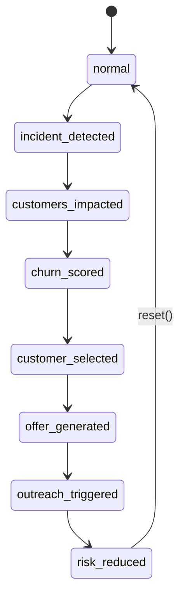

# Plan: VodafoneThree Customer Intelligence Command Center

## Context

- Working directory `/Users/pjose/Documents/GitHub/Vdf3` does not yet exist — greenfield scaffold.
- Memory file [vodafone_three_operator_pulse.md](/memories/vodafone_three_operator_pulse.md) records a prior React Native VodafoneThree demo. Reusable conventions: brand tokens (red `#E60000`, ink `#0A0A0A`, mist `#F4F4F6`); single context driving cross-screen consistency; deterministic synthetic data in `src/data/*.ts`. This new build is a **separate, web-based, executive-grade** Vite app (not RN), but we will reuse the brand language and the "single state drives all screens" pattern.
- Required stack: Vite + React + TS + Tailwind + shadcn/ui + Framer Motion + Apache ECharts + MapLibre GL + Sonner + Lucide. React Router for client-side routing.
- Tone: internal command center, white/grey, Vodafone red accent only, executive SaaS — not consumer marketing.

## Design system

- Tailwind theme extension:
  - `vfRed: #E60000`, `vfRedDark: #B30000`, `ink: #111111`, `inkSoft: #1f2937`, `mist: #f7f7f7`, `amber: #F59E0B`, `green: #10B981`.
  - Font: Inter (system fallback). Large display weights for headings.
- shadcn/ui primitives: `Button`, `Card`, `Badge`, `Tabs`, `Sheet`/`Drawer`, `Tooltip`, `Separator`, `Progress`, `ScrollArea`, `Table`.
- Logo: `public/vodafonethree-logo.svg` placeholder (text wordmark "VodafoneThree" with red speech-mark dot) referenced as `` so it can be swapped for a real asset later. Two badges in chrome: `Internal` (outline), `Live Simulation` (red dot pulse).

## Routes & app shell

- `src/main.tsx` → `BrowserRouter` with routes: `/`, `/command-center`, `/customer/:id`, `/architecture`.
- `src/components/AppShell.tsx` — shared header (logo + badges + user "Customer Intelligence Ops" + env "Demo") and toaster mount.
- `Sonner` `<Toaster richColors position="top-right" />` mounted once in shell.

## State machine (single source of truth)

`src/state/DemoStateProvider.tsx` — React context exposing:

```ts
type Stage = 'normal'|'incident_detected'|'customers_impacted'|'churn_scored'
  |'customer_selected'|'offer_generated'|'outreach_triggered'|'risk_reduced';

interface DemoState {
  stage: Stage;
  selectedCustomerId: string;          // default 'CUST-001' Amelia Hughes
  isPlaying: boolean;
  advance(): void; reset(): void; setStage(s:Stage): void;
  selectCustomer(id:string): void;
}
```

The provider auto-advances stages on a timer when `isPlaying`, and exposes derived selectors used everywhere: `getChurnRiskFor(id)` returns before/after/projected based on `stage`, `getIncidentSeverity()`, `getMapIntensity()`, etc. This guarantees consistency: KPI strip, map, customer list, Customer 360, timeline, offer panel all read from the same provider — matching the consistency rules in the prompt.



## Data files (`src/data/`)

- `vodafoneThreeFacts.ts` — KPI strip facts (29M, £11bn, 99% by 2030, 99.96% by 2034, 16,500 sq km, 7M Three/SMARTY, 600+/8,000 sites, 50M/71%, brands list).
- `customers.ts` — 5 customers (Amelia, Daniel, Sophie, Ravi, Grace) per spec, plus 1 suppressed (`CUST-006`) to demonstrate suppression rules. Includes profile fields (tenure, plan, device, spend, CLV, contract, consent, household lines, productHoldings).
- `churn.ts` — per-customer churn object (risk, 30/60/90, trend, model version `CHURN_MODEL_UK_MOBILE_V3.2`, drivers with contribution+evidence+signalType, decisioning rules, suppression). Plus aggregate datasets: risk distribution, churn-by-segment, risk-by-driver, revenue-at-risk.
- `offers.ts` — ranked next-best-actions per customer (3 commercial offers + non-offer actions like apology, service credit, network ticket escalation).
- `networkEvents.ts` — primary `NET-INC-2026-0428-MAN-M14` incident object (full schema from prompt) + secondary lower-severity events for other cities.
- `mapCells.ts` — UK city cell-clusters with `[lng,lat]`, status, intensity for the 10 cities listed; Manchester M14 has fine-grained sub-clusters for radius animation.
- `architecture.ts` — typed nodes/edges for the 9-layer architecture diagram + per-node descriptions, Snowflake capability mappings.
- `timeline.ts` — 9 timeline events (09:31 → 09:46) tied to stages. Plus per-customer recent-events timeline for `/customer/:id`.
- `careAndUsage.ts` — care history + usage/billing + network experience blocks for `/customer/:id`.

## Pages

### `/` Landing — `src/pages/Landing.tsx`
- Hero with title, subtitle, two CTAs (`Launch Command Center`, `View Architecture`).
- 6-card executive KPI strip with Framer Motion `count-up` (use a small `useCountUp` hook).
- 6-card capability grid (Lucide icons: `Activity`, `Sparkles`, `Wrench`, `User`, `Signal`, `BarChart3`).
- Animated alert preview using staggered Framer Motion.
- Subtle SVG node-grid background.

### `/command-center` — `src/pages/CommandCenter.tsx`
Layout (CSS grid):
```
+--------------------------------------------+
| AppShell header                            |
+----------+----------------------+----------+
| LeftCol  |  CenterCol           | RightCol |
| KPIs     |  UK MapLibre map     | Cust 360 |
| AtRisk   |  Incident overlay    | drawer   |
| list     |  Charts row          |          |
+----------+----------------------+----------+
|  Bottom: animated Timeline strip           |
+--------------------------------------------+
```
- `LeftPanel`: `ExecutiveKpiStrip` (compact) + `AtRiskCustomerList` (selectable cards, animate active).
- `CenterPanel`: `UkNetworkMap` (MapLibre, free demo style `https://demotiles.maplibre.org/style.json` or a vector positron equivalent — purely client-side, no token), pulsing red circle on Manchester, expanding radius via animated GeoJSON layer driven by stage; cell-site markers; legend. Below the map: `IncidentCard` + a compact charts row (`NetworkQualityTrend`, `IncidentImpactByCity`).
- `RightPanel`: `Customer360Drawer` (always-visible side panel on desktop, sheet on mobile) — Tabs: Overview, Churn, Network, Care, Usage & Billing, Offers.
- Bottom: `LiveTimeline` horizontal strip.
- Top-right: `DemoControls` (Restart / Play-Pause / step-forward).

### `/customer/:id` — `src/pages/Customer360Page.tsx`
- Header: name, ID, brand, location, churn-risk badge, save priority, contract status.
- Sections: Profile, Churn Intelligence (gauge + 30/60/90 cards + 12-week trend ECharts line + driver bars + evidence panel + model meta), Network Experience, Care History, Usage & Billing, Next-Best-Actions list, Recent customer timeline.
- Reads from same data + state provider as command center.

### `/architecture` — `src/pages/Architecture.tsx`
- Title + subtitle + a small disclaimer card: "Browser demo uses hardcoded data. Diagram below shows production Snowflake-native deployment pattern."
- Animated left-to-right SVG diagram with 9 columns: Sources → Ingestion → Bronze → Silver → Gold → AI/ML Decisioning → Activation, plus full-width overlays for Governance and Observability/FinOps. Particles flow via Framer Motion `motion.circle` along precomputed paths.
- Each node opens a tooltip/popover with the bullet detail from `architecture.ts`.
- Snowflake capability callouts: Snowpipe Streaming, Dynamic Tables, Streams & Tasks, Snowpark, Snowpark ML, Cortex AI / `AI_COMPLETE`, masking & row-access policies, tagging, lineage, access history. Position Snowflake as governed data cloud + decisioning + activation layer (not just DB).

## Components (`src/components/`)

- `app/AppHeader.tsx` (logo, badges, user, env)
- `app/StatusBadge.tsx` (Internal, Live Simulation pulse)
- `kpi/KpiCard.tsx` + `KpiStrip.tsx`
- `customers/AtRiskCustomerList.tsx`, `CustomerListItem.tsx`
- `customer360/Customer360.tsx` + tab subcomponents (`OverviewTab`, `ChurnTab`, `NetworkTab`, `CareTab`, `UsageBillingTab`, `OffersTab`)
- `churn/ChurnGauge.tsx` (ECharts gauge), `ChurnTrendChart.tsx`, `ChurnDriverBars.tsx`, `EvidencePanel.tsx`
- `offers/NextBestActionList.tsx`, `OfferCard.tsx`, `RecommendedActionHeadline.tsx`
- `map/UkNetworkMap.tsx` (MapLibre)
- `incident/IncidentCard.tsx`, `WorkflowSteps.tsx`
- `timeline/LiveTimeline.tsx`
- `charts/` — ECharts wrapper `EChart.tsx` + `RiskDistribution.tsx`, `ChurnBySegment.tsx`, `RiskByDriver.tsx`, `RevenueAtRisk.tsx`, `OfferAcceptanceMatrix.tsx`, `IncidentImpactByCity.tsx`, `NetworkQualityTrend.tsx`.
- `architecture/ArchitectureDiagram.tsx`, `ArchitectureNode.tsx`, `ParticleFlow.tsx`, `GovernanceOverlay.tsx`.
- `ui/` — shadcn-generated primitives.

## Animations (Framer Motion)

- KPI count-up on landing.
- Card stagger-fade for capability grid and alert preview.
- Map: SVG/GeoJSON radius `scale` + `opacity` keyframe pulse on Manchester; intensity tied to stage.
- Customer list: active card scale `1.02` + ring.
- Churn gauge: animate value from 42 → 82 → 41 in sync with stages.
- Offer card: "Calculating…" shimmer → reveal ranked offers.
- Timeline: active dot pulses red, completed get green check, current scrolls into view.
- Architecture: continuous particle flow + sequential layer reveal on first view.

## Toasts (Sonner) tied to stages

- `incident_detected` → error toast "Network degradation detected: Manchester M14"
- `customers_impacted` → info "2,417 customers identified as potentially impacted"
- `offer_generated` → success "Retention action generated for P1 customer"
- `risk_reduced` → success "Projected churn risk reduced by 41 points"

## Implementation order (task list)

1. Scaffold Vite React-TS app, install dependencies, configure Tailwind + shadcn, set up brand tokens, project structure, ESLint/TS strict, public logo placeholder.
2. Create all `src/data/*.ts` files with the exact, fully-typed datasets specified above (single source of truth for cross-screen consistency).
3. Build `DemoStateProvider`, routing, `AppShell` with header/badges/toaster, brand theme, base layout primitives.
4. Implement Landing page (`/`) — hero, KPI strip with count-up, capability grid, alert preview animation, CTAs.
5. Implement Command Center (`/command-center`) shell + LeftPanel (KPIs + at-risk list) + DemoControls + LiveTimeline wired to state machine.
6. Implement MapLibre UK map with cell-cluster markers, animated incident radius, severity legend, stage-driven intensity.
7. Implement Customer 360 (drawer + dedicated `/customer/:id` page) with all six tabs, churn gauge/trend/driver/evidence, offers, care, usage, network.
8. Implement Next-Best-Action panel with calculating animation, ranked offers, recommended-action headline, suppression rules display.
9. Implement remaining ECharts dashboards (risk distribution, churn-by-segment, risk-by-driver, revenue-at-risk, network quality, offer acceptance matrix, incident impact by city).
10. Implement Architecture page (`/architecture`) — animated 9-layer diagram with particle flow, governance/observability overlays, Snowflake capability callouts, node tooltips.
11. Polish pass: typography, spacing, responsiveness (≥1280px primary, graceful 1024/768), dark text contrast, motion-reduce respect, toast cadence, Sonner styling, README with run instructions.

## Verification

- `npm run dev` → all four routes render without console errors.
- Click "Launch Command Center" → state machine cycles through all 8 stages; map, KPI, customer list, Customer 360, offers, timeline, and toasts all stay in sync.
- Selecting a different at-risk customer in the list updates the right-panel Customer 360 and `/customer/:id` deep link.
- Reset returns everything to `normal` baseline.
- `npm run build` succeeds with no TS errors (`tsc --noEmit`); `npm run lint` clean.
- Manual visual QA: Vodafone red used only as accent; whitespace generous; no PowerBI feel; Manchester incident is the visual focal point.
- Responsive sanity: 1440 / 1280 / 1024 widths.

## Critical files

- `src/state/DemoStateProvider.tsx` — the state machine that ties every panel together; consistency depends on this.
- `src/data/customers.ts`, `src/data/churn.ts`, `src/data/offers.ts` — single-source-of-truth datasets driving list, Customer 360, churn detail, and offers.
- `src/data/networkEvents.ts` + `src/components/map/UkNetworkMap.tsx` — incident model and the map that visualizes it; central to the demo story.
- `src/pages/CommandCenter.tsx` — orchestrates left/center/right/bottom panels and binds them to state.
- `src/pages/Architecture.tsx` + `src/data/architecture.ts` — animated Snowflake-native architecture; closes the executive narrative.